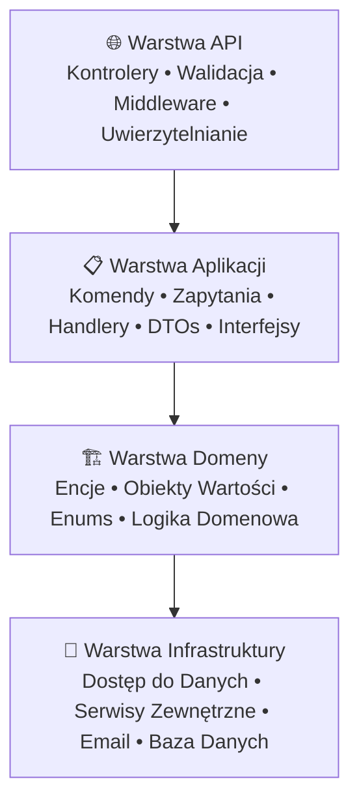

# 🏆 CalorieTracker - System Zarządzania Żywieniem Klasy Enterprise

<div align="center">


**🚀 Profesjonalna aplikacja do monitorowania diety zbudowana z użyciem wzorców klasy enterprise i najlepszych praktyk**

[🌐 **LIVE DEMO - API**](https://ct-backend-texableplum.azurewebsites.net/index.html) • [📚 **DOKUMENTACJA**](https://texableplum.github.io/CalorieTracker/) • [Funkcjonalności](#-kluczowe-funkcjonalności) • [Architektura](#%EF%B8%8F-przegląd-architektury) • [Tech Stack](#%EF%B8%8F-stack-technologiczny)

</div>

---

## 🎯 Opis Projektu

CalorieTracker to **gotowa do produkcji**, **enterprise-grade** aplikacja do zarządzania żywieniem zaprojektowana z wykorzystaniem **zasad Clean Architecture** i **Domain-Driven Design**. Projekt demonstruje zaawansowane praktyki programistyczne w .NET, pokazując prawidłowe rozdzielenie odpowiedzialności, zasady SOLID oraz standardowe wzorce projektowe.

### 🔥 Co Cechuje Ten Projekt

- **🏗️ Clean Architecture** - Idealne rozdzielenie warstw Domain, Application, Infrastructure i API
- **📋 Wzorzec CQRS** - Command Query Responsibility Segregation dla optymalnej wydajności
- **🔐 Bezpieczeństwo** - Uwierzytelnianie JWT z refresh tokenami, integracja z Identity framework
- **📊 Zaawansowany ORM** - Entity Framework Core z niestandardowymi konfiguracjami
- **✅ Kompleksowa Walidacja** - FluentValidation z niestandardowymi walidatorami i obsługą błędów
- **🔄 Profesjonalne Mapowanie** - Profile AutoMapper dla czystego transferu danych
- **📖 Dokumentacja OpenAPI** - Integracja Swagger z uwierzytelnianiem JWT
- **🎨 Wzorce Projektowe** - Repository, Factory, Strategy i inne
- **🧪 Struktura Gotowa do Testów** - Łatwo testowalna dzięki dependency injection
- **☁️ Deployment w Chmurze** - Hostowana na Microsoft Azure

---

## 🌐 Live Demo i Dokumentacja

### 🚀 **Dostępne Online**
- **[🔗 Live API + Swagger UI](https://ct-backend-texableplum.azurewebsites.net/index.html)** - Pełna dokumentacja API z możliwością testowania
- **[📖 Dokumentacja GitHub Pages](https://texableplum.github.io/CalorieTracker/)** - Szczegółowa dokumentacja techniczna
- **🔐 Testowe Konto**: Użyj endpointu `/api/auth/register` lub skontaktuj się w celu otrzymania danych testowych

### 📋 **Instrukcja Testowania API**
1. Przejdź do [Swagger UI](https://ct-backend-texableplum.azurewebsites.net/index.html)
2. **Rejestracja**: Użyj endpointu `POST /api/auth/register` z prawidłowymi danymi
3. **Potwierdzenie Email**: Sprawdź skrzynkę email i użyj kodu z `POST /api/auth/confirm`
4. **Logowanie**: Zaloguj się używając `POST /api/auth/login`
5. **Autoryzacja**: Skopiuj otrzymany token JWT i kliknij "Authorize" w Swagger UI
6. **Profil**: Uzupełnij profil przez `PUT /api/profile` - **WYMAGANE** do korzystania z większości funkcji
7. **Testowanie**: Testuj dowolne endpointy API - większosć wymaga kompletnego profilu

> **⚠️ Uwaga**: Większość funkcjonalności wymaga uzupełnionego profilu użytkownika (wiek, płeć, wzrost, waga, cele itd.). Aplikacja automatycznie blokuje dostęp do funkcji bez kompletnych danych.

---

## ✨ Kluczowe Funkcjonalności

### 🍎 Funkcjonalność Biznesowa
- **Kompleksowe Śledzenie Żywienia** - Logowanie posiłków, śledzenie makroskładników, monitorowanie dziennego spożycia
- **Zarządzanie Przepisami** - Tworzenie niestandardowych przepisów z kalkulacją składników
- **Monitorowanie Wagi** - Śledzenie zmian wagi z analizą trendów
- **Dziennik Nawodnienia** - Śledzenie dziennego spożycia wody
- **Baza Produktów** - Obszerna baza produktów spożywczych z informacjami żywieniowymi

### 🔧 Doskonałość Techniczna
- **Projekt API RESTful** - Czysta, spójna struktura endpointów
- **Zaawansowane Uwierzytelnianie** - Tokeny JWT z mechanizmem odświeżania
- **Integracja Email** - Weryfikacja konta i resetowanie hasła z zewnętrznym API
- **Konfiguracja CORS** - Gotowa do integracji z frontendem
- **Migracje Bazy Danych** - Kontrola wersji zmian w schemacie
- **Obsługa Błędów** - Kompleksowe zarządzanie wyjątkami
- **Hosting w Chmurze** - Wdrożona na Microsoft Azure
- **User Secrets** - Bezpieczne przechowywanie danych wrażliwych
- **Testy Jednostkowe** - Pokrycie testami serwisów domenowych
- **Atrybut Kompletności Profilu** - Automatyczna kontrola dostępu do funkcji
- **CI/CD Pipeline** - GitHub Actions z automatycznym wdrażaniem
- **Automatyczna Dokumentacja** - GitHub Pages buduje docs przy każdym push

---

## 🏛️ Przegląd Architektury

Aplikacja implementuje zasady **Clean Architecture** z wyraźnym rozdzieleniem odpowiedzialności:



### 🎯 Zaimplementowane Wzorce Projektowe

| Wzorzec | Implementacja | Cel |
|---------|----------------|-----|
| **CQRS** | Oddzielne Handlery Command/Query | Optymalne operacje odczytu/zapisu |
| **Repository** | Abstrakcja `IAppDbContext` | Oddzielenie dostępu do danych |
| **Factory** | Generowanie tokenów JWT | Scentralizowane tworzenie tokenów |
| **Strategy** | Wybór szablonów email | Elastyczna obsługa emaili |
| **Builder** | Konfiguracje Fluent API | Czysty kod konfiguracyjny |
| **Dependency Injection** | Wbudowany kontener .NET DI | Luźne powiązania |

---

## 🛠️ Stack Technologiczny

### **Backend Core**
- **🔹 .NET 9** - Zaawansowany framework z najnowszymi możliwościami
- **🔹 ASP.NET Core Web API** - Wysokowydajny framework webowy
- **🔹 Entity Framework Core** - Zaawansowany ORM z obsługą LINQ
- **🔹 SQL Server** - Baza danych klasy enterprise

### **Uwierzytelnianie i Bezpieczeństwo**
- **🔐 ASP.NET Core Identity** - Framework zarządzania użytkownikami
- **🔐 JWT Bearer Authentication** - Bezstanowe uwierzytelnianie tokenowe
- **🔐 Implementacja Refresh Token** - Bezpieczne odnawianie tokenów

### **Walidacja i Mapowanie**
- **✅ FluentValidation** - Ekspresyjne reguły walidacji
- **🔄 AutoMapper** - Mapowanie obiekt-do-obiekt
- **📋 Niestandardowe Walidatory** - Egzekwowanie reguł biznesowych
- **🛡️ Atrybuty Autoryzacji** - `RequireCompleteProfile` dla kontroli dostępu

### **Dokumentacja i API**
- **📖 Swagger/OpenAPI** - Interaktywna dokumentacja API
- **🌐 CORS** - Współdzielenie zasobów między domenami
- **📊 Strukturalne Logowanie** - Kompleksowa obsługa logów
- **🔐 User Secrets** - Bezpieczne przechowywanie kluczy API

### **Narzędzia Deweloperskie**
- **🧪 Dependency Injection** - Wbudowany kontener IoC
- **⚙️ Zarządzanie Konfiguracją** - Elastyczne ustawienia aplikacji
- **📧 Serwisy Email** - Integracja z zewnętrznym API email
- **🔄 Migracje Bazy Danych** - Kontrola wersji schematu
- **🧪 Testy Jednostkowe** - Kompleksowe testy serwisów domenowych

### **Hosting i DevOps**
- **☁️ Microsoft Azure** - Hosting w chmurze
- **🚀 GitHub Actions** - Automatyczne CI/CD pipeline
- **📖 GitHub Pages** - Automatyczne budowanie dokumentacji
- **📊 Application Insights** - Monitorowanie aplikacji

---

## 🚀 Rozpoczęcie Pracy

### Wymagania
- **✅ .NET 9 SDK** - [Pobierz tutaj](https://dotnet.microsoft.com/download/dotnet/9.0)
- **✅ SQL Server** - LocalDB, Express lub pełna wersja
- **✅ Visual Studio 2022** lub **VS Code** z rozszerzeniem C#

### 🔧 Instalacja

1. **Sklonuj repozytorium**
```bash
git clone https://github.com/TexablePlum/CalorieTracker.git
cd CalorieTracker
```

2. **Skonfiguruj bazę danych**
```bash
# Zaktualizuj connection string w appsettings.json
# Uruchom migracje
dotnet ef database update --project CalorieTracker.Infrastructure
```

3. **Skonfiguruj ustawienia JWT**
```json
{
  "Jwt": {
    "Key": "twoj-super-tajny-klucz-jwt-minimum-256-bitow",
    "Issuer": "CalorieTracker",
    "Audience": "CalorieTracker-Users",
    "ExpiryMinutes": 60
  }
}
```

4. **Uruchom aplikację**
```bash
dotnet run --project CalorieTracker.Api
```

5. **Dostęp do Swagger UI**
   - Przejdź do `https://localhost:7000` (lub inny skonfigurowany port)
   - Eksploruj i testuj endpointy API

---

## 📚 Dokumentacja API

### 🔐 AuthController - Uwierzytelnianie i autoryzacja

| Metoda | Endpoint | Opis | Parametry |
|--------|----------|------|-----------|
| `POST` | `/api/auth/register` | Rejestracja nowego użytkownika z weryfikacją email | `{ email, password, firstName?, lastName? }` |
| `POST` | `/api/auth/login` | Logowanie użytkownika z tokenami JWT | `{ email, password }` |
| `POST` | `/api/auth/confirm` | Potwierdzenie adresu email 6-cyfrowym kodem | `{ email, code }` |
| `POST` | `/api/auth/resend-code` | Ponowne wysłanie kodu aktywacyjnego (throttling 60s) | `{ email }` |
| `POST` | `/api/auth/refresh` | Odświeżanie wygasłych tokenów JWT | `{ accessToken, refreshToken }` |
| `POST` | `/api/auth/logout` | Wylogowanie i unieważnienie refresh tokenów | `{ refreshToken }` |
| `POST` | `/api/auth/forgot-password` | Inicjacja procesu resetowania hasła | `{ email }` |
| `POST` | `/api/auth/reset-password` | Resetowanie hasła kodem weryfikacyjnym | `{ email, code, newPassword }` |

### 👤 ProfileController - Zarządzanie profilem użytkownika

| Metoda | Endpoint | Opis | Wymagania |
|--------|----------|------|-----------|
| `GET` | `/api/profile` | Pobranie kompletnego profilu użytkownika | 🔐 Auth |
| `PUT` | `/api/profile` | Aktualizacja profilu z automatycznym zarządzaniem wagą | 🔐 Auth |

### 🍎 ProductsController - Zarządzanie produktami spożywczymi

| Metoda | Endpoint | Opis | Wymagania |
|--------|----------|------|-----------|
| `GET` | `/api/products/search` | Wyszukiwanie produktów z filtrami i paginacją | 🔐 Auth + 📋 Profile |
| `GET` | `/api/products/{id}` | Szczegóły produktu po ID | 🔐 Auth + 📋 Profile |
| `GET` | `/api/products/barcode/{barcode}` | Wyszukiwanie produktu po kodzie kreskowym | 🔐 Auth + 📋 Profile |
| `GET` | `/api/products/user` | Lista produktów użytkownika z paginacją | 🔐 Auth + 📋 Profile |
| `POST` | `/api/products` | Tworzenie nowego produktu spożywczego | 🔐 Auth + 📋 Profile |
| `PUT` | `/api/products/{id}` | Aktualizacja produktu (tylko właściciel) | 🔐 Auth + 📋 Profile + 🎯 Owner |
| `DELETE` | `/api/products/{id}` | Usunięcie produktu (tylko właściciel) | 🔐 Auth + 📋 Profile + 🎯 Owner |

### 🍳 RecipesController - System przepisów kulinarnych

| Metoda | Endpoint | Opis | Wymagania |
|--------|----------|------|-----------|
| `GET` | `/api/recipes/search` | Wyszukiwanie przepisów z filtrami | 🔐 Auth + 📋 Profile |
| `GET` | `/api/recipes/{id}` | Szczegóły przepisu z kalkulacją wartości odżywczych | 🔐 Auth + 📋 Profile |
| `GET` | `/api/recipes/user` | Lista przepisów użytkownika | 🔐 Auth + 📋 Profile |
| `GET` | `/api/recipes/all` | Wszystkie przepisy publiczne z paginacją | 🔐 Auth + 📋 Profile |
| `POST` | `/api/recipes` | Tworzenie nowego przepisu z składnikami | 🔐 Auth + 📋 Profile |
| `PUT` | `/api/recipes/{id}` | Aktualizacja przepisu (tylko właściciel) | 🔐 Auth + 📋 Profile + 🎯 Owner |
| `DELETE` | `/api/recipes/{id}` | Usunięcie przepisu (tylko właściciel) | 🔐 Auth + 📋 Profile + 🎯 Owner |

### ⚖️ WeightMeasurementsController - Monitorowanie wagi

| Metoda | Endpoint | Opis | Wymagania |
|--------|----------|------|-----------|
| `GET` | `/api/weight-measurements` | Historia pomiarów wagi użytkownika | 🔐 Auth + 📋 Profile |
| `GET` | `/api/weight-measurements/latest` | Najnowszy pomiar wagi | 🔐 Auth + 📋 Profile |
| `GET` | `/api/weight-measurements/{id}` | Szczegóły konkretnego pomiaru | 🔐 Auth + 📋 Profile |
| `POST` | `/api/weight-measurements` | Dodanie nowego pomiaru wagi | 🔐 Auth + 📋 Profile |
| `PUT` | `/api/weight-measurements/{id}` | Aktualizacja pomiaru wagi | 🔐 Auth + 📋 Profile + 🎯 Owner |
| `DELETE` | `/api/weight-measurements/{id}` | Usunięcie pomiaru wagi | 🔐 Auth + 📋 Profile + 🎯 Owner |

### 📊 NutritionTrackingController - Śledzenie żywienia

| Metoda | Endpoint | Opis | Wymagania |
|--------|----------|------|-----------|
| `GET` | `/api/nutrition-tracking/daily-progress` | Kompletny dzienny postęp żywieniowy | 🔐 Auth + 📋 Profile |
| `GET` | `/api/nutrition-tracking/nutrition-requirements` | Dzienne zapotrzebowanie żywieniowe (BMR/TDEE) | 🔐 Auth + 📋 Profile |
| `GET` | `/api/nutrition-tracking/meal-history` | Historia posiłków z filtrowaniem po dacie | 🔐 Auth + 📋 Profile |
| `POST` | `/api/nutrition-tracking/log-meal` | Logowanie posiłku (produkt lub przepis) | 🔐 Auth + 📋 Profile |
| `PUT` | `/api/nutrition-tracking/meals/{id}` | Aktualizacja wpisu posiłku | 🔐 Auth + 📋 Profile + 🎯 Owner |
| `DELETE` | `/api/nutrition-tracking/meals/{id}` | Usunięcie wpisu posiłku | 🔐 Auth + 📋 Profile + 🎯 Owner |
| `POST` | `/api/nutrition-tracking/log-water` | Logowanie spożycia wody | 🔐 Auth + 📋 Profile |
| `PUT` | `/api/nutrition-tracking/water/{id}` | Aktualizacja wpisu wody | 🔐 Auth + 📋 Profile + 🎯 Owner |
| `DELETE` | `/api/nutrition-tracking/water/{id}` | Usunięcie wpisu wody | 🔐 Auth + 📋 Profile + 🎯 Owner |
| `GET` | `/api/nutrition-tracking/water/quick-options` | Predefiniowane opcje ilości wody | 🔐 Auth |

### 📝 Legenda wymagań
- **🔐 Auth** - Wymagane uwierzytelnienie (token JWT)
- **📋 Profile** - Wymagany kompletny profil użytkownika (atrybut `RequireCompleteProfile`)
- **🎯 Owner** - Dostęp tylko dla właściciela zasobu

---

## 🏗️ Struktura Projektu

```
CalorieTracker/
├── 🌐 CalorieTracker.Api/               # Warstwa API
│   ├── Controllers/                    # Kontrolery REST API
│   ├── Models/                         # Modele żądań/odpowiedzi API
│   ├── Validation/                     # Walidatory FluentValidation
│   └── Program.cs                      # Punkt wejścia aplikacji
│
├── 📋 CalorieTracker.Application/      # Warstwa Aplikacji
│   ├── Auth/                          # Logika uwierzytelniania
│   ├── Interfaces/                    # Kontrakty aplikacji
│   ├── Recipes/                       # Zarządzanie przepisami
│   ├── Nutrition/                     # Kalkulacje żywieniowe
│   └── Profiles/                      # Profile AutoMapper
│
├── 🏗️ CalorieTracker.Domain/           # Warstwa Domeny
│   ├── Entities/                      # Encje domenowe
│   ├── Enums/                         # Wyliczenia domenowe
│   └── ValueObjects/                  # Obiekty wartości
│
└── 💾 CalorieTracker.Infrastructure/   # Warstwa Infrastruktury
    ├── Data/                          # Kontekst bazy danych
    ├── Services/                      # Serwisy zewnętrzne
    └── Configurations/                # Konfiguracje encji
```

---

## 🎯 Najważniejsze Aspekty Jakości Kodu

### **🏛️ Implementacja Clean Architecture**
```csharp
// Idealne rozdzielenie odpowiedzialności z abstrakcjami interfejsów
public interface IAppDbContext
{
    DbSet<Recipe> Recipes { get; }
    DbSet<Product> Products { get; }
    Task<int> SaveChangesAsync(CancellationToken ct = default);
}
```

### **📋 Wzorzec CQRS z Handlerami**
```csharp
// Rozdzielenie Command/Query dla optymalnej wydajności
public class CreateRecipeHandler
{
    private readonly IAppDbContext _db;
    
    public async Task<CreateRecipeResponse> Handle(
        CreateRecipeCommand command)
    {
        // Implementacja logiki biznesowej
    }
}
```

### **✅ Zaawansowana Walidacja**
```csharp
// FluentValidation z niestandardowymi regułami biznesowymi
public class CreateRecipeRequestValidator : AbstractValidator<CreateRecipeRequest>
{
    public CreateRecipeRequestValidator()
    {
        RuleFor(x => x.Name)
            .NotEmpty().WithMessage("Nazwa przepisu jest wymagana")
            .MaximumLength(200);
            
        RuleFor(x => x.Ingredients)
            .NotEmpty().WithMessage("Wymagany co najmniej jeden składnik")
            .Must(HaveValidIngredients);
    }
}
```

### **🛡️ Kontrola Dostępu z Atrybutem Kompletności**
```csharp
// Automatyczne blokowanie dostępu bez kompletnego profilu
[RequireCompleteProfile]
[HttpPost("log")]
public async Task<IActionResult> LogMeal([FromBody] LogMealRequest request)
{
    // Ta akcja wymaga uzupełnionego profilu użytkownika
    // Atrybut automatycznie sprawdza wszystkie wymagane pola
}
```

### **🔐 Bezpieczeństwo z User Secrets**
```csharp
// JWT z refresh tokenami + bezpieczne przechowywanie kluczy
builder.Services.AddAuthentication(JwtBearerDefaults.AuthenticationScheme)
    .AddJwtBearer(options =>
    {
        options.TokenValidationParameters = new TokenValidationParameters
        {
            ValidateIssuer = true,
            ValidateAudience = true,
            ValidateLifetime = true,
            ClockSkew = TimeSpan.Zero,
            // Klucze API przechowywane w User Secrets
            IssuerSigningKey = new SymmetricSecurityKey(
                Encoding.UTF8.GetBytes(configuration["Jwt:Key"]))
        };
    });
```

### **🧪 Testy Jednostkowe Serwisów**
```csharp
// Kompleksowe testy serwisów domenowych z mockami
[Fact]
public void CalculateDailyRequirements_MaleProfile_ShouldCalculateCorrectBMR()
{
    // Arrange - profil mężczyzny 30 lat, 180cm, 80kg
    var profile = CreateUserProfile(Gender.Male, 30, 180, 80);
    
    // Act - kalkulacja wymagań żywieniowych
    var result = _service.CalculateDailyRequirements(profile);
    
    // Assert - weryfikacja BMR według formuły Mifflin-St Jeor
    Assert.Equal(1780f, result.BMR);
}
```

---

## 🔄 Kluczowe Decyzje Projektowe

### **1. Wybór Clean Architecture**
- **Dlaczego**: Zapewnia testowalność, łatwość utrzymania i skalowalność
- **Korzyść**: Wyraźne rozdzielenie logiki biznesowej od problemów infrastrukturalnych

### **2. Implementacja CQRS**
- **Dlaczego**: Optymalizuje operacje odczytu/zapisu niezależnie
- **Korzyść**: Lepsza wydajność i elastyczność dla złożonych zapytań

### **3. Integracja FluentValidation**
- **Dlaczego**: Ekspresyjne, łatwe w utrzymaniu reguły walidacji
- **Korzyść**: Scentralizowana logika walidacji z jasnymi komunikatami błędów

### **4. Użycie AutoMapper**
- **Dlaczego**: Redukuje kod mapowania boilerplate
- **Korzyść**: Czyste DTOs i rozdzielenie encji domenowych

### **5. Strategia JWT + Refresh Token**
- **Dlaczego**: Bezstanowe uwierzytelnianie z bezpieczeństwem
- **Korzyść**: Skalowalne uwierzytelnianie odpowiednie dla systemów rozproszonych

### **6. Hosting w Azure z User Secrets**
- **Dlaczego**: Profesjonalne środowisko produkcyjne z bezpiecznym zarządzaniem sekretami
- **Korzyść**: Demonstracja umiejętności DevOps, cloud computing i security best practices

### **7. Zewnętrzne API Email**
- **Dlaczego**: Integracja z profesjonalnymi serwisami email (SMTP)
- **Korzyść**: Pokazuje umiejętność integracji z zewnętrznymi dostawcami usług

### **8. Testy Jednostkowe**
- **Dlaczego**: Zapewnienie jakości kodu i pokrycie krytycznych ścieżek
- **Korzyść**: Demonstracja profesjonalnego podejścia do testowania i TDD

### **10. GitHub Actions CI/CD**
- **Dlaczego**: Automatyzacja buildów, testów i wdrożeń
- **Korzyść**: Demonstracja umiejętności DevOps i automatyzacji procesów

### **11. GitHub Pages dla Dokumentacji**
- **Dlaczego**: Automatyczne generowanie i publikowanie dokumentacji
- **Korzyść**: Pokazuje podejście documentation-as-code i continuous documentation

---

## 🌟 Osiągnięcia Techniczne

- ✅ **Zero błędów i warningów kompilacji** - Czysty, dobrze zorganizowany kod
- ✅ **Pełna dokumentacja XML** - Każda klasa i metoda udokumentowana
- ✅ **Spójne konwencje nazewnictwa** - Polskie komentarze, angielskie nazwy
- ✅ **Zasady SOLID** - Implementowane konsekwentnie w całym projekcie
- ✅ **Obsługa błędów** - Kompleksowe zarządzanie wyjątkami
- ✅ **Bezpieczeństwo** - User Secrets, zewnętrzne API, JWT security
- ✅ **Wydajność** - Optymalizowane zapytania i architektura
- ✅ **Testowalność** - Struktura gotowa do unit i integration testów
- ✅ **Pokrycie testami** - Testy jednostkowe serwisów domenowych
- ✅ **Production-ready** - Hosting w Azure z CI/CD
- ✅ **Automatyzacja** - GitHub Actions pipeline z auto-deployment
- ✅ **Living Documentation** - GitHub Pages z auto-generated docs

---

## 🤝 Wkład w Rozwój

Ten projekt stosuje standardy rozwoju enterprise:

- **Styl Kodu**: Konwencje kodowania Microsoft C#
- **Architektura**: Zasady Clean Architecture
- **Wzorce**: Zasady SOLID i sprawdzone wzorce projektowe
- **Testowanie**: Struktura gotowa do testów jednostkowych i integracyjnych
- **Dokumentacja**: Kompleksowa dokumentacja XML

---

## 📞 Kontakt

🔗 **📧 **porebskid8@gmail.com** | 🌐 **[Portfolio](https://github.com/TexablePlum)**

---

## 📄 Licencja

Ten projekt jest licencjonowany na licencji MIT - zobacz plik [LICENSE](LICENSE) dla szczegółów.

---

<div align="center">

**🏆 Zbudowane z pasją do inżynierii oprogramowania**

*Demonstracja zaawansowanych umiejętności programistycznych w .NET i najlepszych praktyk*

### 🌐 **[ZOBACZ LIVE DEMO](https://ct-backend-texableplum.azurewebsites.net/index.html)** 🌐

⭐ **Oznacz gwiazdką to repozytorium, jeśli uznałeś je za wartościowe!** ⭐

</div>
