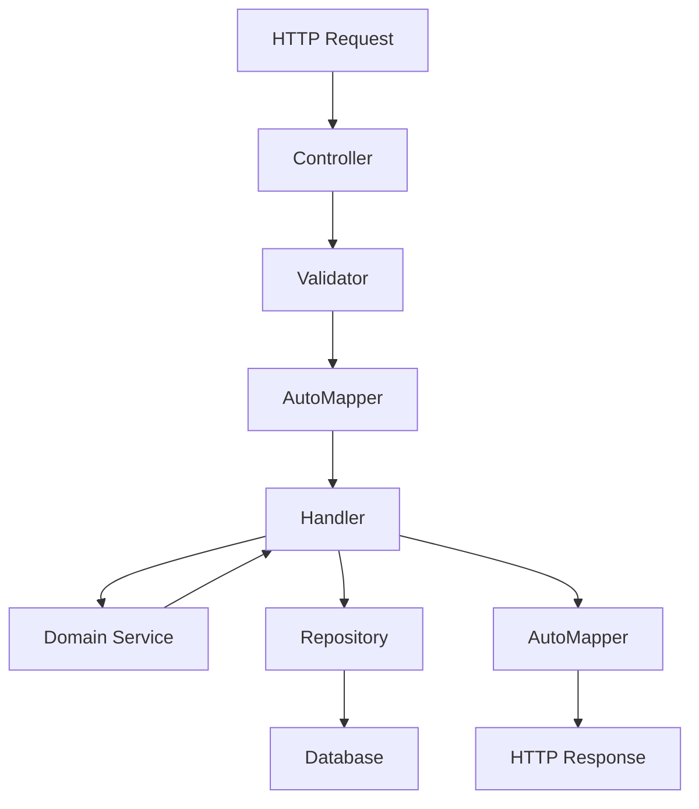

# Architektura aplikacji

## Przegląd

CalorieTracker został zbudowany w oparciu o **Clean Architecture** z wyraźnym podziałem odpowiedzialności między warstwami.

## Warstwy architektury

### 🎯 Domain Layer (`CalorieTracker.Domain`)

**Odpowiedzialność:** Podstawowa logika biznesowa i reguły domeny

**Zawiera:**
- **Entities** - Encje biznesowe (`Product`, `Recipe`, `UserProfile`, `WeightMeasurement`)
- **Value Objects** - Obiekty wartości (`RecipeNutrition`)
- **Enums** - Typy wyliczeniowe (`ProductCategory`, `ActivityLevel`, `Gender`)
- **Domain Services** - Serwisy domenowe (`RecipeNutritionCalculator`, `WeightAnalysisService`)

**Zasady:**
- Brak zależności od zewnętrznych bibliotek
- Zawiera tylko czystą logikę biznesową
- Definiuje interfejsy dla warstw wyższych

### 🚀 Application Layer (`CalorieTracker.Application`)

**Odpowiedzialność:** Orkiestracja logiki biznesowej i koordynacja przepływu danych

**Zawiera:**
- **Commands/Queries** - Obiekty CQRS (`CreateProductCommand`, `GetRecipeDetailsQuery`)
- **Handlers** - Implementacje logiki biznesowej (`CreateProductHandler`, `LoginUserHandler`)
- **Interfaces** - Kontrakty dla warstwy Infrastructure (`IAppDbContext`, `IEmailSender`)

**Wzorce:**
- **CQRS** (Command Query Responsibility Segregation)
- **Mediator Pattern** (poprzez handlery)
- **Repository Pattern** (poprzez `IAppDbContext`)

### 🔧 Infrastructure Layer (`CalorieTracker.Infrastructure`)

**Odpowiedzialność:** Implementacja szczegółów technicznych i integracji zewnętrznych

**Zawiera:**
- **Data Access** - Entity Framework, kontekst bazy danych (`AppDbContext`)
- **Authentication** - Generacja JWT (`JwtGenerator`)
- **Email** - Wysyłka emaili (`EmailSender`)
- **External Services** - Integracje z API zewnętrznymi

**Implementuje:**
- Interfejsy z warstwy Application
- Konfiguracje Entity Framework
- Serwisy infrastrukturalne

### 🌐 Presentation Layer (`CalorieTracker.Api`)

**Odpowiedzialność:** Obsługa żądań HTTP i prezentacja danych

**Zawiera:**
- **Controllers** - Endpointy REST API (`AuthController`, `ProductsController`)
- **Models** - DTO dla API (`RegisterRequest`, `ProductDto`)
- **Validation** - FluentValidation rules (`RegisterRequestValidator`)
- **Mapping** - AutoMapper profiles (`ProductMappingProfile`)
- **Attributes** - Custom attributes (`RequireCompleteProfileAttribute`)

## Przepływ danych



## Wzorce projektowe

### CQRS (Command Query Responsibility Segregation)

**Commands** - Modyfikują stan systemu
```csharp
public record CreateProductCommand
{
    public string Name { get; init; } = null!;
    public float CaloriesPer100g { get; init; }
    // ...
}

public class CreateProductHandler
{
    public async Task<Guid> Handle(CreateProductCommand command)
    {
        // Logika tworzenia produktu
    }
}
```

**Queries** - Odczytują dane
```csharp
public record GetProductByIdQuery(Guid Id);

public class GetProductByIdHandler
{
    public async Task<Product?> Handle(GetProductByIdQuery query)
    {
        // Logika pobierania produktu
    }
}
```

### Repository Pattern

```csharp
public interface IAppDbContext
{
    DbSet<Product> Products { get; }
    DbSet<Recipe> Recipes { get; }
    Task<int> SaveChangesAsync(CancellationToken ct = default);
}
```

### Dependency Injection

Wszystkie zależności są rejestrowane w `Program.cs`:

```csharp
// Handlers
builder.Services.AddScoped<CreateProductHandler>();
builder.Services.AddScoped<RecipeNutritionCalculator>();

// Infrastructure
builder.Services.AddScoped<IAppDbContext>(sp => sp.GetRequiredService<AppDbContext>());
builder.Services.AddScoped<IJwtGenerator, JwtGenerator>();
```

## Bezpieczeństwo

### Uwierzytelnianie
- **JWT Tokens** - Stateless authentication
- **Refresh Tokens** - Bezpieczne odświeżanie sesji
- **Email Confirmation** - Weryfikacja adresów email

### Autoryzacja
- **Custom Attributes** - `[RequireCompleteProfile]`
- **Claims-based** - Dostęp na podstawie roszczeń użytkownika
- **Owner-based** - Użytkownicy mogą edytować tylko swoje zasoby

### Walidacja
- **FluentValidation** - Walidacja wszystkich modeli API
- **Model Binding** - Automatyczna walidacja ASP.NET Core
- **Business Rules** - Walidacja w handlerach i serwisach domenowych

## Testowanie

### Unit Tests (`CalorieTracker.Tests`)

**Pokrycie:**
- Serwisy domenowe (`RecipeNutritionCalculatorTests`)
- Logika biznesowa (`WeightAnalysisServiceTests`)
- Kalkulacje matematyczne (BMI, wartości odżywcze)

**Wzorce testowe:**
- **AAA Pattern** (Arrange-Act-Assert)
- **Theory/InlineData** - Testy parametryzowane
- **Helper Methods** - Fabryki obiektów testowych

## Konfiguracja

### Database
- **Entity Framework Core** - ORM
- **Code First** - Migracje z kodu
- **SQL Server** - Produkcyjna baza danych
- **LocalDB** - Development

### Email
- **MailKit** - Biblioteka email
- **SMTP** - Wysyłka przez serwery zewnętrzne
- **Templates** - HTML templates dla emaili

### Logging
- **ASP.NET Core Logging** - Built-in logging
- **Structured Logging** - JSON format
- **Multiple Providers** - Console, File, Application Insights

## Rozszerzalność

### Dodawanie nowych funkcji
1. Utwórz encje w `Domain`
2. Dodaj Commands/Queries w `Application`
3. Implementuj Handlers
4. Utwórz Controllers i Models w `API`
5. Dodaj testy w `Tests`

### Integracje zewnętrzne
- Implementuj interfejsy w `Infrastructure`
- Zarejestruj w DI container
- Użyj w handlerach poprzez interfejsy

### Monitoring
- Application Insights integration
- Health checks endpoints
- Performance monitoring